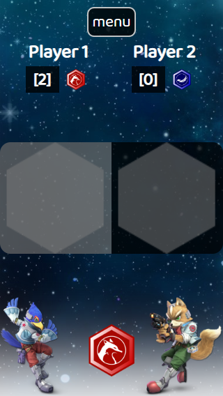
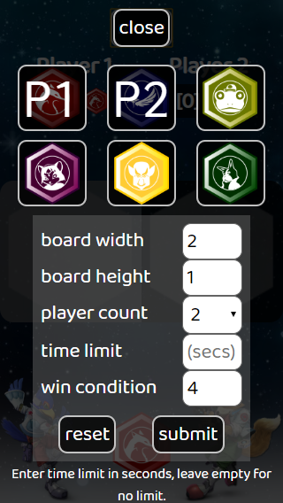

# Connect

A front end JavaScript application of Connect Four for those who want a bigger board

## Technologies Used

- JavaScript (ES6)
- CSS3
- HTML5

## Live Demo

Try the application live at https://connect.jwenning.digital.

## Features

- Player can select tokens
- Player can set board dimensions
- Player can set a player count
- Player can set a time limit
- Player can set a win condition
- Player can pause by opening the menu

## Previews

